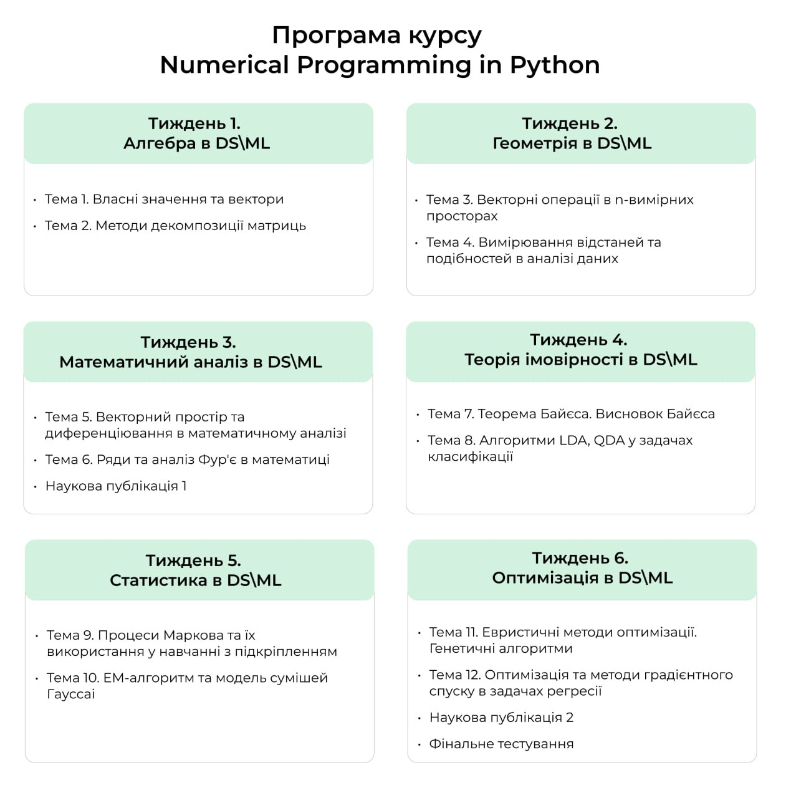

# Numerical Programming in Python

## Використані бібліотеки в проєкті

| Назва бібліотеки | Опис                                                        | Як встановити                                    |
| ---------------- | ----------------------------------------------------------- | ------------------------------------------------ |
| **pandas**       | Аналіз та обробка табличних даних                           | `pip install pandas`                             |
| **numpy**        | Робота з багатовимірними масивами та науковими обчисленнями | `pip install numpy`                              |
| **seaborn**      | Візуалізація статистичних даних                             | `pip install seaborn`                            |
| **matplotlib**   | Бібліотека для створення графіків                           | `pip install matplotlib`                         |
| **sklearn**      | Інструменти для машинного навчання                          | `pip install scikit-learn`                       |
| **colorama**     | Додавання кольорів до виводу в консоль                      | `pip install colorama`                           |
| **nltk**         | Опрацювання природної мови                                  | `pip install nltk`                               |
| **gym**          | Середовище для навчання агентів з підкріпленням             | `pip install gym`                                |
| **librosa**      | Аналіз та обробка аудіо даних                               | `pip install librosa`                            |
| **pygad**        | Реалізація генетичних алгоритмів                            | `pip install pygad`                              |
| **plotly**       | Інтерактивна візуалізація даних                             | `pip install plotly`                             |
| **scipy**        | Математичні, наукові та інженерні обчислення                | `pip install scipy`                              |
| **pickle**       | Збереження та завантаження Python-об’єктів                  | (Вбудована бібліотека, не потребує встановлення) |
| **IPython**      | Інтерактивна робота в Python                                | `pip install ipython`                            |
| **pyplot**       | Функціональність для швидкого створення графіків            | (Частина `matplotlib`)                           |
| **pygad**        | Інструменти для роботи з генетичними алгоритмами            | `pip install pygad`                              |
| **zipfile**      | Робота з архівами ZIP                                       | (Вбудована бібліотека, не потребує встановлення) |
